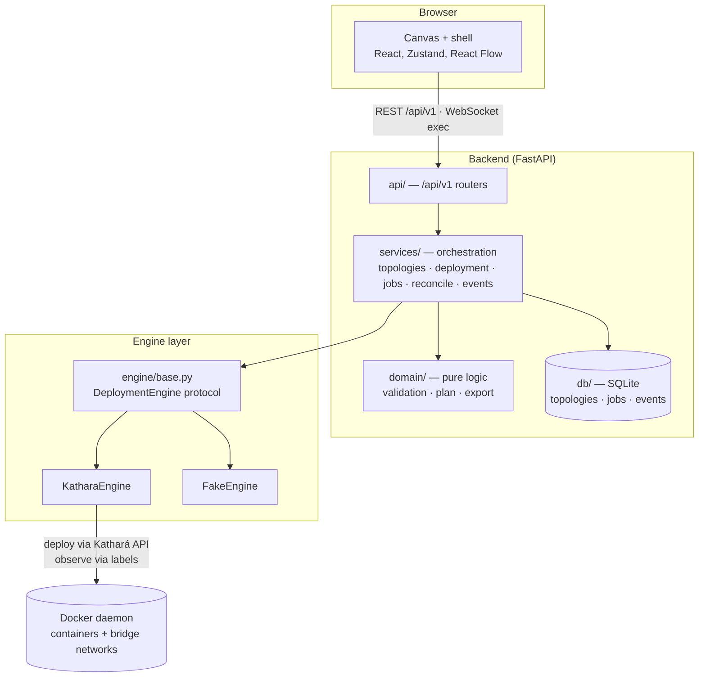
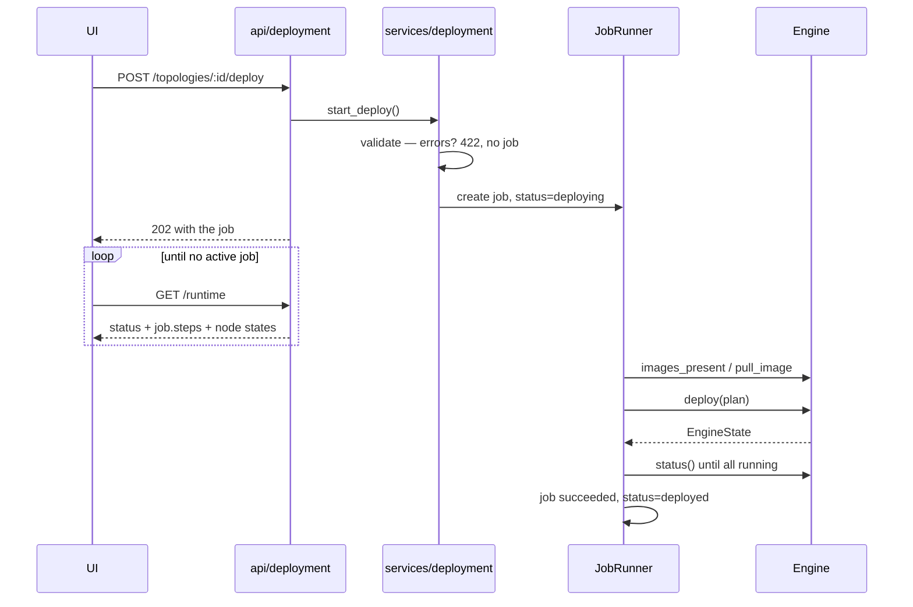

# AE3GIS Architecture Guide

**Audience:** developers working on AE3GIS. Read this once before your first
change; it explains the shape of the system and the handful of ideas everything
else follows from.

For the short version, see the root [`README.md`](../README.md). For the rules
Claude Code follows when editing this repo, see [`CLAUDE.md`](../CLAUDE.md).

---

## 1. What AE3GIS is

AE3GIS is a **network topology editor that deploys what you draw**. You design a
multi-site ICS/IT network in a browser canvas, and the backend turns that design
into real Linux containers wired together with real IP addressing and routing,
so you can open a shell on a device and ping across subnets.

Three tiers:

| Tier | Job |
|---|---|
| **Frontend** | Draw and edit the topology. Visualise state. Never decides how anything deploys. |
| **Backend** | Store the design, validate it, compute the lab plan, run deployments as jobs, track runtime state. |
| **Engine** | Instantiate a lab plan as containers. Kathará today, swappable. |

The guiding principle: **the backend is the source of truth for everything
derived**. The frontend owns the design document and how it looks; the backend
owns what that document *means* — whether it is valid, what it would deploy,
what is running right now.

---

## 2. Quickstart

### Run it

```bash
./start.sh              # docker compose up --build
```

- Editor: <http://localhost:3000>
- API docs: <http://localhost:8000/api/v1/docs>

There is no sign-in screen. The API is open by default, which suits a local lab
and **not** a shared host, since the API creates and destroys containers. To
require a token, set it for both services and rebuild:

```bash
AE3GIS_INSTRUCTOR_TOKEN=your-token docker compose up --build
```

### A ten-minute tour

1. Open the editor. Under **Presets**, click **Use preset** on *Two-Subnet
   Demo*. You land in the canvas at the deepest useful level.
2. Walk the drill-down with the breadcrumb: **Network → Site → Subnet**. Select
   a subnet and press <kbd>E</kbd> to expand it in place instead of drilling in.
3. Click **Deploy**. Watch the status pill move through the job's steps
   (`validate → images → plan → deploy → verify`). The first deploy pulls
   images, so it takes a minute.
4. When node dots turn green, double-click a device to open a terminal, then
   `ping` a host in the other subnet. Routing was generated for you.
5. Select any device and open **Deployment plan** in the inspector: machine
   name, image, interfaces, and the exact boot commands the engine ran.
6. Click **Destroy**, then open **Labs on this host** in the library to confirm
   nothing was left behind.

### Develop without Docker

The backend ships an in-memory engine, so you can run the whole stack with no
containers at all:

```bash
cd backend && AE3GIS_ENGINE=fake python -m uvicorn main:create_app --factory --port 8000
cd frontend && npm run dev     # :5173, proxies /api to :8000
```

Deploys succeed instantly and every node reports running. Terminals will not
work (there is no container to attach to), but every other flow does.

### The commands you will actually use

```bash
# Frontend (cd frontend)
npm run dev          # vite dev server, :5173
npm run build        # typecheck + production bundle
npm run test         # vitest
npm run lint         # eslint
npm run api:types    # regenerate src/api/schema.d.ts from backend/openapi.json

# Backend (cd backend)
python -m pytest                          # full suite, ~1s, no Docker needed
ruff check . && ruff format --check .     # both are CI gates
python scripts/export_openapi.py          # regenerate openapi.json after API changes
python -m uvicorn main:create_app --factory --reload --port 8000
```

---

## 3. The big picture



Two things to notice:

- **Routers are thin.** `api/` validates input shapes and calls a service.
  Orchestration lives in `services/`, decisions live in `domain/`.
- **Nothing imports an engine directly.** Services receive one through
  `app.state`, which is why the whole test suite runs in about a second against
  `FakeEngine` with no Docker.

---

## 4. The three contracts

Almost every design question in this codebase is answered by one of these.

### 4.1 The topology document is opaque JSON

The backend stores `Topology.data` **exactly as the frontend sends it** and
never reshapes or strips it. `api/schemas.py` types only the envelope
(`TopologyCreate`, `TopologyRecord`, …), each with `data: dict`.

The frontend owns the document's shape in
[`frontend/src/types/topology.ts`](../frontend/src/types/topology.ts), where
every entity carries an index signature so unknown fields round-trip untouched.
Either side can add a field without the other changing.

```
sites[] → subnets[] → containers[]
        ↘ subnetConnections[]     ↘ connections[]
siteConnections[]
```

So what stops garbage reaching the engine? Not a schema — **diagnostics**
(§4.2). A draft is allowed to be incomplete; a deploy is not.

> Proven by `backend/tests/test_api_v1.py::test_unknown_fields_round_trip`.

### 4.2 Diagnostics, not schema rejection

[`domain/validation.py`](../backend/domain/validation.py) returns a list of
`Diagnostic { code, severity, message, path, node_id }`.

| Severity | Meaning | Effect |
|---|---|---|
| `error` | The engine cannot work around it | Deploy refused (422 `validation_failed`) |
| `warning` | The engine will guess, or ignore the field | Shown, deploy allowed |

Saving **never** fails validation. The frontend shows diagnostics in the
inspector's *Issues* section and disables Deploy while errors exist; the backend
enforces the same rule server-side, so an API client cannot skip it.

Examples of each: a duplicate IP inside a subnet or a subnet with inter-subnet
links but no router are errors; an unknown node type (deploys as a plain host)
or `persistencePaths` (stored, not applied by the Kathará engine) are warnings.

### 4.3 The node catalog is data

[`backend/catalog/node_types.json`](../backend/catalog/node_types.json) is the
single source of truth for node types, served at `GET /api/v1/catalog`. It is
validated at load by the pydantic models in `catalog/models.py`, and served with
that model, so the frontend's catalog types are generated from OpenAPI too.

```jsonc
"categories": [{ "id": "security", "label": "Security" }, …],     // palette order
"sources": { "ae3gis-containers": { "kind": "git", "url": "…", "ref": "main" } },
"images": {
  "ae3gis.local/nftables": {
    "displayName": "nftables", "stability": "stable",            // | experimental | hidden
    "source": { "kind": "build", "repo": "ae3gis-containers", "context": "nftables", "dockerfile": "dockerfile" },
    "platforms": ["linux/amd64", "linux/arm64"]                  // optional
  }
},
"types": {
  "firewall": {
    "displayName": "Firewall", "role": "router", "category": "security",
    "defaultImage": "kathara/frr",
    "images": ["kathara/frr", "ae3gis.local/iptables", "ae3gis.local/nftables", "ae3gis.local/firehol"],
    "color": "#ff3344", "label": "FW", "icon": "firewall", "purdueLevel": 3.5
  }
}
```

`role` (`router` | `switch` | `host`) drives how the engine configures the node.
A type's `images` are its **variants**: interchangeable images for the same job
(the palette nests them under the type, the inspector's Variant picker switches
between them). `images` at the top level describes image refs; a ref it does not
list is pulled from a registry as before, and one with a `build` source is built
by AE3GIS (§5.6). Unknown types degrade to `host` rather than blocking a deploy.

**Adding a node type should be a one-line JSON edit.** It appears in the
palette, add menus, inspector type picker, and Purdue view automatically (they
all read one grouping, `frontend/src/catalog/tree.ts`). Only a genuinely new
glyph needs code, in `frontend/src/catalog/icons.tsx`.

### 4.4 (Bonus) The API contract is generated

`backend/openapi.json` is generated from the live app by
`backend/scripts/export_openapi.py`, and CI fails if it is stale. The frontend
generates its TypeScript types from that file (`npm run api:types` →
`src/api/schema.d.ts`), so the backend is the typed source of truth for the API.

**Change an endpoint → regenerate both.**

---

## 5. Backend

### 5.1 Layers

```
main.py           create_app(settings, engine) — the only entry point
  ├── config.py   Settings (pydantic-settings, AE3GIS_* env)
  ├── api/        thin routers under /api/v1, one error envelope
  ├── services/   orchestration; owns transactions and state transitions
  ├── domain/     pure functions; no DB, no engine, no FastAPI
  ├── engine/     the seam + implementations + terminal bridge
  └── db/         SQLAlchemy models + Alembic migrations
```

| Directory | Contains | Depends on |
|---|---|---|
| `api/` | `topologies`, `deployment`, `jobs`, `images`, `system`, `catalog`, `presets`, `deps`, `errors`, `schemas` | services, domain |
| `services/` | `topologies`, `deployment`, `jobs` (+ `joblogs`), `images`, `sources`, `reconcile`, `events` | domain, engine, db |
| `domain/` | `topology` (read helpers), `validation`, `plan`, `images` (fingerprints, statuses), `export/` | catalog only |
| `engine/` | `base` (protocol), `kathara/`, `fake`, `docker_build`, `terminal` | domain |
| `db/` | `models`, `session`, `migrations/` | — |

`main.create_app` takes its settings and engine as arguments and does nothing at
import time. Uvicorn runs it with `--factory`; tests build their own app with a
temporary SQLite file and a `FakeEngine`.

### 5.2 The API surface

All under `/api/v1`. Errors share one envelope: `{"detail": ..., "code": ...}`
plus extras (`diagnostics`, `current_version`), so clients branch on `code`
rather than matching message text.

| Endpoint | Purpose |
|---|---|
| `GET/POST /topologies`, `GET/PUT/DELETE /topologies/{id}` | CRUD. `PUT` takes `version` for optimistic concurrency |
| `POST /topologies/import-json` | Import a design file |
| `POST /topologies/validate` | Validate a document without saving |
| `POST /topologies/{id}/validate` | Validate what is stored |
| `GET /topologies/{id}/plan` | The computed lab plan |
| `GET /topologies/{id}/export?format=` | `labspec` \| `kathara` \| `containerlab` |
| `POST /topologies/{id}/deploy`, `.../destroy` | 202 + a job |
| `GET /topologies/{id}/runtime` | Status + active job + node states, in one call |
| `GET /topologies/{id}/events`, `.../jobs`, `GET /jobs/{id}` | History |
| `GET /jobs/{id}/log?offset=`, `POST /jobs/{id}/cancel` | A job's log (by byte offset), cancellation |
| `GET /images?topology_id=` | Build support, image sources, and each image's status |
| `POST /images/builds`, `POST /sources/{name}/sync` | 202 + build jobs / a sync job |
| `GET /topologies/{id}/context` | Record + diagnostics + plan + runtime + events |
| `GET /system/health`, `/system/labs`, `POST /system/reconcile`, `/system/labs/{hash}/purge` | Operations |
| `WS /topologies/ws/{id}/exec/{container_id}` | Interactive shell |

`context` exists for clients that need the whole picture at once — a support
view, or the planned agent.

### 5.3 Jobs: how long operations work

Deploy used to run inside the HTTP request with no progress and no persisted
intermediate state. Now every long operation is a row in `jobs`.



- **Steps.** Deploy runs `validate → images → plan → deploy → verify`; destroy
  runs `undeploy → verify`; an image build runs `source → snapshot → build →
  verify`. Each transition is written to the job row and mirrored into `events`.
- **Subjects.** A job serialises on its `subject`: `topology:<id>`,
  `image:<ref>` or `source:<name>`. One job runs at a time per subject; a second
  deploy returns 409 `job_active`, while a second build of the same image
  returns the running job. Only topology jobs set `topology_id`.
- **Logs.** Every job appends to `data/job-logs/<job id>.log` (`runner.log`,
  step progress included); `GET /jobs/{id}/log` pages it by byte offset. Logs are
  capped (the end is always kept) and deleted after two weeks.
- **Waiting and cancelling.** A job can `await runner.wait(other)` (a deploy
  waits on the builds it needs). Kinds registered `cancellable` can be
  cancelled; a deploy only until `runner.point_of_no_return` (the engine starting
  to create containers). Builds and syncs are cancelled at shutdown so a restart
  or dev reload never waits on a 20-minute build.
- **Failure cleans up.** Before the engine deploys, the job records a
  provisional `engine_state` (the lab name, from which the hash follows), so a
  deploy that dies part-way is still torn down; the job error and log carry the
  output of any node whose container exited (`engine.node_logs`).
- **Restart recovery.** Jobs still marked running at startup are failed
  (`"Server restarted…"`); a topology left `deploying`/`destroying` moves to
  `error`, and reconcile fixes the rest.

Status lifecycle: `idle → deploying → deployed → destroying → idle`, with any
failure landing in `error` (destroy works from there).

### 5.4 Reconcile: DB versus reality

The database's opinion and the Docker daemon can drift — someone removes a
container by hand, or an older backend leaves a lab behind.
[`services/reconcile.py`](../backend/services/reconcile.py) classifies every lab
the engine reports:

| Class | Meaning | Action |
|---|---|---|
| `tracked` | Lab hash matches a topology's `engine_state` | Nothing |
| `stale` | Topology says deployed, no such lab exists | Reset to `idle` (automatic at startup) |
| `orphan` | Lab exists, no topology references it | Listed; purged only on request |

Exposed as **Labs on this host** in the library UI, and run once at startup.

### 5.5 Persistence

SQLite via Alembic (`db/migrations/`). Three tables:

- **`topologies`** — `data` (the opaque document), `engine_state` (how to find
  the deployed lab), `status`, `version`.
- **`jobs`** — kind, `subject`, `params`, status, ordered `steps`, error
  (`topology_id` only for topology jobs; logs are files, see §5.3).
- **`events`** — append-only log per topology; the UI reads it, and it is the
  audit trail a future agent will consume.

`version` increments on every content change. `PUT` may send the version it last
saw; a mismatch returns 409 `version_conflict` and the UI offers to reload. This
is what keeps a human and an agent from silently overwriting each other.

> **Any schema change needs a migration.** `0001_baseline` deliberately no-ops
> on databases created before migrations existed, so live data volumes upgrade
> in place.

### 5.6 Node images built from Dockerfiles

Images with a `build` source in the catalog are built by AE3GIS
(`services/images.py`, `services/sources.py`):

- **Sources.** A `git` source is cloned into `data/sources/<name>` on first use
  and refreshed by *Sync* (a job: fetch the configured ref, reset, then report
  which built images changed). `AE3GIS_SOURCE_OVERRIDES` points a source at a
  local checkout for Dockerfile work. Only git needs the `git` binary (it ships
  in the backend image); without it, already-built images still deploy.
- **Builds** are jobs, at most `AE3GIS_MAX_CONCURRENT_BUILDS` at a time. A build
  copies its context to `data/build-ctx/<job>` first (so a sync mid-build cannot
  change what gets built), then runs `docker buildx build --load` (BuildKit;
  `--load` puts the image in the daemon's store whatever builder is selected).
- **Staleness.** Each build stamps a *fingerprint* label: a SHA-256 of the
  Dockerfile path, every file in the context and the build args
  (`domain/images.py`), plus the source commit. An image's status compares that
  label with the fingerprint of the current source: `ready`, `stale`, `missing`,
  `building`, `failed`, `unmanaged` (built by hand), `unavailable` (cannot be
  built on this host: no buildx, source unreachable, wrong platform). Nothing is
  scanned at startup. Upstream drift (new packages, a moved base image) is
  invisible to the fingerprint; *Rebuild from scratch* (`--pull --no-cache`)
  covers it.
- **Deploys** build what they need: the `images` step starts (or joins) builds
  for missing images, lists their job ids on the step, pulls registry images,
  and deploys stale images as they are with a `deploy.images_stale` warning.
- **UI.** Palette dots and the inspector's Variant picker show status; a banner
  over the canvas lists images the topology still needs, with *Build now*; the
  **Images** sheet (library, *More*, ⌘K) manages sources, builds and logs; the
  deploy status badge opens the job's steps and logs, build logs included.

---

## 6. Frontend

### 6.1 One canvas, projected

The old editor had three near-identical React Flow views. Now there is one
canvas and a **pure projection** of the topology into it:

```
URL (/t/:id/site/:siteId/subnet/:subnetId)  →  Scope
                                                  │
store.topology + store.expanded + containerStatus + selection
                                                  │  canvas/projection.ts  project()   ← pure, tested
                                                  ▼
                         React Flow nodes/edges (site | subnet | device | group)
```

- **Scope** is the drill-down focus and comes *only* from the URL, so any view
  is linkable and survives reload. `resolveScope` falls back up the chain when a
  deep link is stale; `defaultScopeFor` opens single-child topologies deeper.
- **Expanded** ids render as group nodes with their children inside. This is why
  the same data can show one, two, or three levels at once: **nothing is nested
  in the data model — nesting is a rendering decision.**
- **Edges re-target.** An inter-subnet link attaches to the gateway routers when
  both subnets are expanded, and to the subnet nodes when they are collapsed, so
  a link always lands on something visible.
- **Positions** live on the entities. Container positions are relative to their
  subnet, so LAN scope and an expanded group share the same numbers;
  `toStoredPosition` converts back when a node is dragged inside a group.

Because `project()` is pure, canvas behaviour is unit-tested without rendering
anything (`canvas/__tests__/projection.test.ts`).

### 6.2 State

One Zustand store (`store/index.ts`) built from slices:

| Slice | Owns |
|---|---|
| `topology` | The document, `dirty`, and every id-based mutation |
| `document` | Backend id, `version`, deploy status, live `containerStatus`, `activeJob`, `diagnostics` |
| `view` | Selection, `expanded`, theme, tool, panel layout, zoom |
| `terminal` | Open terminal tabs |
| `catalog` | The fetched node catalog |

- Undo/redo via `zundo`, tracking **only** `topology`; loading a topology resets
  history.
- `store/normalize.ts` runs on every load and import: fills missing connection
  ids and node positions so older saved files keep working.
- **Runtime status never enters the saved document.** It lives in `document`
  and is merged in at projection time.

### 6.3 Shell

`shell/` is the frame: top bar, sidebar (palette + explorer tree), inspector,
terminal dock, status bar, command palette (<kbd>⌘K</kbd>). Its slots are
deliberately extensible — sidebar tabs, dock tabs, inspector sections and
palette commands are where deferred features will attach.

`features/` holds the vertical slices: `deployment` (actions, runtime polling,
validation and plan hooks), `topology` (dialogs, add-entity flow), `terminal`,
`purdue`, `system` (labs dialog).

### 6.4 Talking to the backend

Everything goes through `src/api/client.ts`, typed from the generated
`schema.d.ts`. Polling is a single `GET /runtime` call, paced by what is
happening: fast while a job runs, slow while deployed, stopped when idle.

---

## 7. From topology to running containers

The one flow worth understanding in detail.

```
TopologyData (opaque JSON in DB)
        │  domain/validation.validate()      ← errors block deploy
        │  domain/plan.build_lab_plan()      ← pure, unit-tested
        ▼
LabPlan { nodes[], collision domains }
   node = { id, role, image, interfaces[], startup[] }
        │  engine/kathara/lab_builder.build_lab()
        ▼
Kathará Lab (machines + links + a startup script per machine)
        │  KatharaEngine.deploy()
        ▼
Docker containers on bridge networks (one bridge per collision domain)
```

### 7.1 `domain/plan.py` — the interesting part

Pure functions, no engine import, fully tested in `tests/test_plan.py`:

1. **Metadata + gateway detection.** Each container membership records its
   subnet, IP, prefix and gateway. A subnet with no valid gateway falls back to
   the first router in it.
2. **Endpoint resolution.** Connections referencing a *subnet* or *site* id
   resolve to that side's gateway router, so drawing a subnet-to-subnet link in
   the UI wires the right routers automatically.
3. **Interface assignment.** Explicit `ethN` names are honoured, the rest are
   auto-assigned. Every point-to-point link gets its own collision domain
   (`cd0`, `cd1`, …).
4. **IPs and routes.** Intra-subnet links use the device's real IP;
   router-to-router links with no subnet context get a `/30` pair out of
   `10.255.0.0/24`. Static routes to every remote subnet propagate across router
   links by breadth-first search, so multi-hop chains route end to end.
5. **Boot commands per role.** Router: `ip_forward` + per-interface addresses +
   static routes. Switch: a Linux bridge `br0` enslaving its interfaces. Host:
   an address plus a default route via the gateway. All plain iproute2/sysctl,
   so they are engine- and architecture-agnostic.

The same `LabPlan` feeds `domain/export/`, so **what you export is exactly what
deploy runs**: a lab-spec JSON, a Kathará folder (`lab.conf` +
`<machine>.startup`), or a ContainerLab topology (built with `iface_base=1`,
since ContainerLab reserves `eth0` for management).

### 7.2 Kathará specifics, and the bug worth knowing about

Kathará names containers `kathara_<user>_<machine>_<labhash>`, where `<user>`
derives from the **hostname**. The backend's hostname used to be its container
id, so every rebuild produced a new prefix and the backend lost sight of labs it
had deployed: status said everything was stopped, terminals said "device not
found", destroy left orphans behind.

The fix has three parts, and all three matter:

1. **Lab names depend only on the topology id** (`ae3gis_<id[:12]>`), so
   renaming a deployed topology cannot break lookups. `naming.py` can also
   compute Kathará's lab hash itself.
2. **Deploy persists an `EngineState`** (lab name, lab hash, user prefix, node →
   machine map) that later operations read, instead of rebuilding a `Lab` object
   and hoping the hash matches.
3. **Observation goes through Docker labels** (`app=kathara`, `lab_hash`,
   `name`), not Kathará's user-scoped lookups. This is also what lets `purge`
   remove a lab left by an earlier backend instance — something Kathará's own
   undeploy cannot do.

`docker-compose.yml` pins `hostname: ae3gis-backend` so the prefix is stable
anyway. **Do not remove that line.**

### 7.3 Terminals

`engine/terminal.py` bridges a browser xterm.js WebSocket to `docker exec -it`
through a PTY, with window-size messages forwarded as `SIGWINCH`. It is
engine-agnostic: it takes a resolved container name, which the engine supplies.
Terminals require a deployed topology — there is otherwise nothing to attach to.

---

## 8. Invariants and gotchas

Things that will bite if you do not know them:

- **Runtime status never goes into `Topology.data`.** It belongs to
  `document.containerStatus` on the frontend and the engine on the backend.
- **Colours come from tokens, never literals.** `frontend/src/styles/tokens.css`
  defines light and dark; catalog colours are used only as device accents.
- **`persistencePaths` and `config` are stored but not applied** by the Kathará
  engine. Validation says so; do not assume they take effect.
- **SQLAlchemy JSON columns need a deep copy before mutation**, or the `UPDATE`
  is skipped because old and new compare equal. See `services/jobs.py`.
- **Both `ruff check` and `ruff format --check` gate CI.** Running only the
  first has already let a violation through once.
- **Regenerate `openapi.json` and `schema.d.ts` together** after any API change.
- **ContainerLab exports start at `eth1`.** Build the plan with `iface_base=1`
  or the boot commands will reference the wrong interfaces.
- **Kathará runs an image's own `CMD`.** Services start themselves; AE3GIS's
  addressing runs afterwards from `/ae3gis-init.sh` (output in
  `/var/log/ae3gis-init.log`). Nodes are unprivileged, so `/proc/sys` is read-only
  (Kathará sets `ip_forward` itself). A `CMD` that exits kills the node, and the
  deploy reports its output.
- **Built images live under `ae3gis.local/`.** That registry host does not
  resolve, so a missing image fails closed instead of being pulled from Docker
  Hub. Kathará also requires the image's architecture to match the host.

---

## 9. Common tasks

### Add a node type
Edit `backend/catalog/node_types.json`. Reuse an existing `icon` name, or add a
glyph in `frontend/src/catalog/icons.tsx`. Nothing else changes.

### Add a node image built from a Dockerfile
Add the Dockerfile to a source repository (e.g. a folder in
`ae3gis-containers`), then describe it under `images` in
`node_types.json` (`ae3gis.local/<name>`, a `build` source naming the folder,
`platforms` if it is not multi-arch) and list it in a type's `images`. Start it
as `experimental` until it has been built and deployed once.

### Add an API endpoint
Route in `api/`, logic in `services/`, pure helpers in `domain/`. Then:

```bash
cd backend && python scripts/export_openapi.py
cd frontend && npm run api:types
```

Add a test in `backend/tests/test_api_v1.py`.

### Add a validation rule
Extend `domain/validation.py` with a new `code`, choosing `error` only if the
engine genuinely cannot proceed. Add a case to `tests/test_validation.py`. It
surfaces in the inspector automatically.

### Add a canvas feature
State goes in a store slice, rendering in `canvas/`, UI in `shell/` or
`features/`. If it changes what appears on the canvas, extend
`canvas/projection.ts` and its test rather than adding logic inside components.

### Add a deployment engine
Implement the `DeploymentEngine` protocol in `engine/base.py` and return it from
`engine/fake.make_engine` for a new `AE3GIS_ENGINE` value. Services and routers
do not change.

### Add a long-running operation
Register a handler on the `JobRunner` (`services/jobs.py`) and give it named
steps. It gets progress reporting, event logging, failure handling and restart
recovery for free.

---

## 10. Testing and CI

| Suite | Command | Covers |
|---|---|---|
| Backend | `cd backend && python -m pytest` | Validation matrix, lab plan, exporters (golden files), job state machine (cancel, logs, recovery), migrations, catalog models, image fingerprints/statuses, builds and deploy-time builds (FakeEngine + a `path` source), git sync against a local repo, reconcile, naming, API contract |
| Frontend | `cd frontend && npm run test` | Store slices and undo, canvas projection, layout, IP/CIDR helpers, catalog tree, palette, required images, job log paging |

Backend tests use `FakeEngine` and a temporary SQLite file, so the full suite
runs in about a second without Docker.

`.github/workflows/deploy.yml` runs on pushes and pull requests to `main`: a gitleaks
secret scan, backend (`ruff check`, `ruff format --check`, `pytest`, OpenAPI
freshness), and frontend (`eslint`, build, `vitest`). All three gate the deploy
job, which ships over SSH on merge to `main`.

---

## 11. Where this is going

Deferred features, with the seams already in place — see
[`FUTURE_WORK.md`](../FUTURE_WORK.md):

- **Node exec / script runner** over Kathará's native `exec`, using
  `backend/scripts/catalog.json` as its input.
- **Packet capture** (`tcpdump` → downloadable pcap).
- **Live telemetry stream** replacing `/runtime` polling, built on `events`.
- **Agent orchestration** — `GET /topologies/{id}/context` already returns
  everything an agent needs, and `version`/409 makes concurrent edits safe.
- Classroom mode, firewall editor, and a container web-UI proxy.
- **Prebuilt node images** from CI (GHCR), pulled before falling back to a
  local build (§5.6).

> A note on `backend/scripts/`: the read-only mounting its README describes was
> a ContainerLab feature and is **not** wired to the Kathará engine. The catalog
> there is kept as input for the script runner above.
